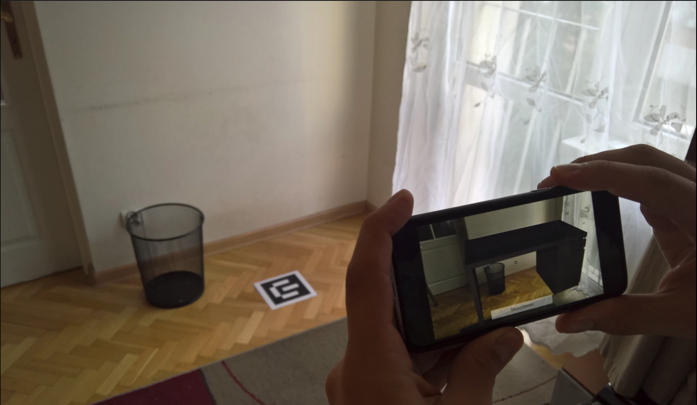
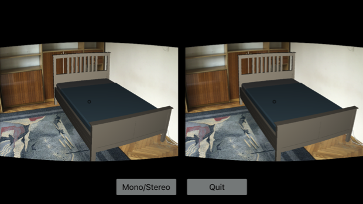

# Master-Thesis

**"Augmented reality visualization system prototype, enhancing a view with virtual items using marker recognition"** — Przemyslaw Blasiak, June 2016.

You can [read the whole thesis](Resources/Master%20Thesis.pdf), available in Polish language only. I can share the source code of the _Enfurio_ app upon request.

1. Mobile experience.

1. Google™ Cardboard experience.

## Program of Study
- [AGH University of Science and Technology](https://www.agh.edu.pl/en)
- [Faculty of Electrical Engineering, Automatics, Computer Science and Biomedical Engineering](https://www.eaiib.agh.edu.pl/?alias=set&lang=en)
- MSc Computer Science, with specialization in Software Engineering
